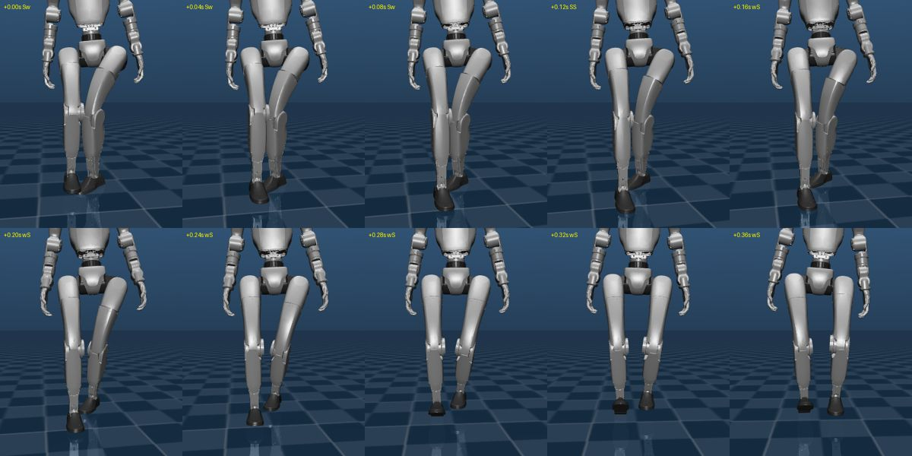
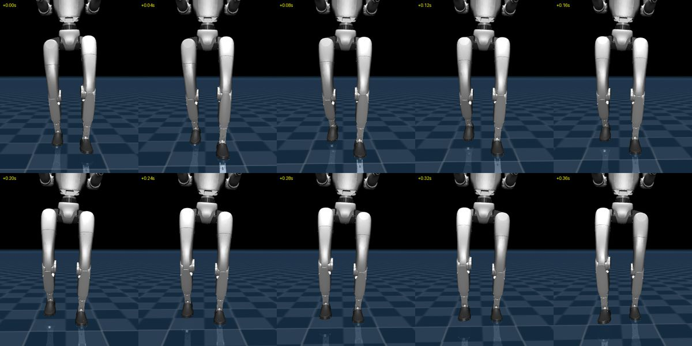
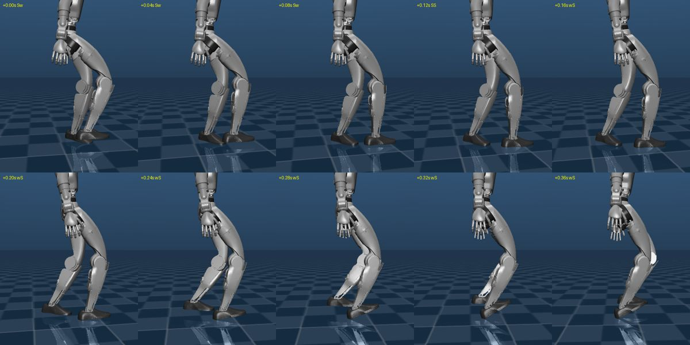
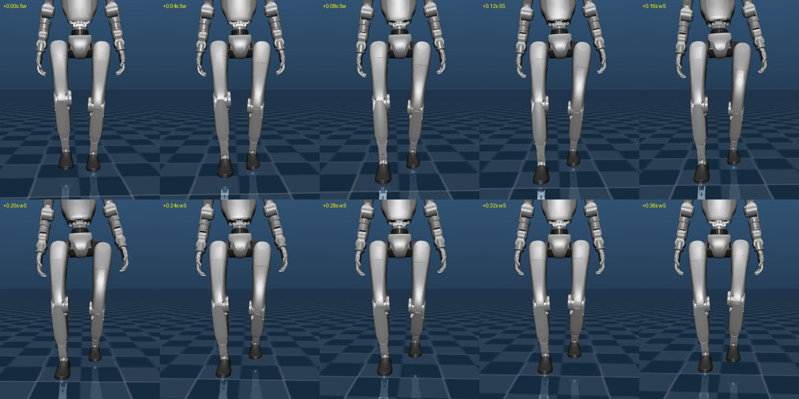
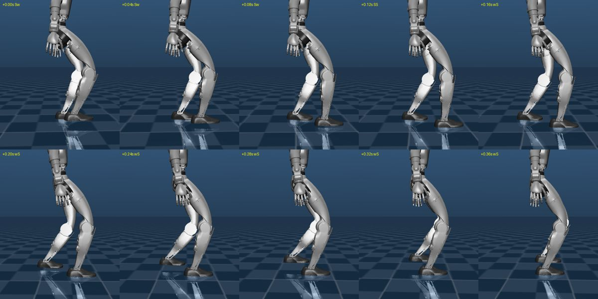
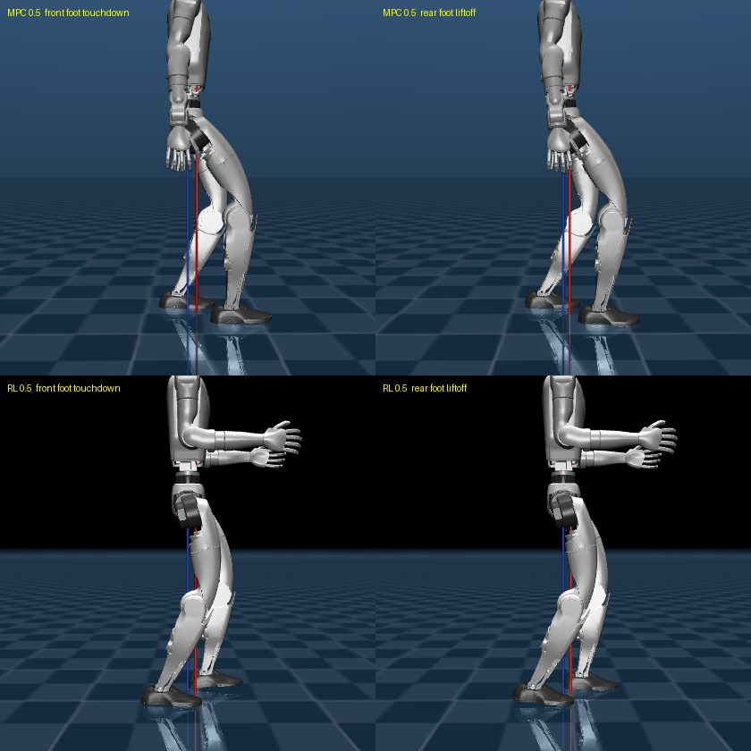

# 2026-09-22 (화) Q&A

| # | 질문 | 한 줄 답 |
|---|---|---|
| Q1 | 착지거리를 늘리면 뭐해, 무릎이 안쪽으로 접히고 발 튀는 것도 그대로다 | **맞다. 둘은 한 사슬이었다.** 발가락이 들리면 발이 뒤꿈치로만 서서 비틀림 마찰이 없어지고, 골반 yaw 진동(16°, RL 2°)에 끌려 발이 **스탠스마다 26°씩 돈다** → 무릎 안쪽 회전 37°. **CoP 여유 0.9** 로 들림 87 → 0 mm, **ω_z 를 골반 각속도로** 바꿔 골반 yaw 16 → 6°, 무릎 방향 37 → 4°. 120 s 네 속도 통과, 대가는 0.7 추종 98 → 90 % |
| Q2 | yaw 처럼 roll·pitch 도 골반 각속도로 해보면? | **축마다 다르다.** pitch 는 섞으면 넘어진다 (100 %: 1.7 s, 50 %: 14 s — 골반 pitch ω 가 전신의 11.7 배). roll 은 100 % 면 나빠지고 **50 % 면 좋아진다** (roll σ 절반, 스윙 모음이 RL 범위). **`--wxpel 0.5` 채택**, 0.7 추종 90 → 87 % |
| Q3 | yaw 변경 전에 CoP 90 % 제한이 큰 요소였나? | **발 쪽은 그렇다** (들림 87→1 mm, 발 미끄럼 27→4°). **골반 yaw 는 ω_z 변경만** 잡았고, **무릎은 둘이 겹쳐** 둘 다 있어야 37→4°. 2×2 요소별 기여도 비교 |
| Q4 | RL 이 지지 시간이 더 긴 느낌 — 이중지지 때 지지발이 더 뒤, 골반이 대칭? | **공간은 관찰 그대로, 시간은 반대.** 앞발 착지 순간 CoM 이 우리는 두 발 사이 **1/4 지점(뒷발 쪽)**, RL 은 **한가운데**. 지지 구간이 우리 쪽이 5~6 cm 앞으로 밀려 있다 (멀리 딛고 일찍 뗌). 지지 시간은 우리가 더 길다 (449 vs 430 ms). **이륙 직전 우리 뒷발은 발가락 하중 0, 뒤꿈치로 뗀다 — RL 은 발가락 끝으로 민다** |
| Q5 | 뷰어에 sim 시간·실제 시간·현재 속도를 띄울 수 없나? | **넣었다.** 두 뷰어 공용 `viewer_hud.py` — sim/real time, 배속, 명령·평균·순간 속도, 추종 % |
| Q6 | MPC 가 실시간의 0.32 배인 이유, 맞출 수 없나? | **89 % 가 MPC.** 원인은 ① BLAS 다중 스레드가 작은 행렬에서 튐 ② 스윙 발 변수를 등식으로 묶어 풀던 것. 해를 안 바꾸는 최적화로 QP 평균 22.5 → 4.0 ms, **창 없이 약 1.2 배**. 뷰어는 ~60 Hz 갱신 + 실시간 맞춤 |
| Q7 | 뷰어에서 어느 순간부터 sim 시간이 뒤처진다 — QP 가 튀어서? | **QP 아님.** 창 없이 120 s 는 튐도 저하도 없음. 뷰어 중엔 **Windows 가 계산 스레드를 느리게** 돌림 (같은 고정 계산 3 → 8~9 ms). 우선순위·전원 스로틀링 부스트로 **120 s 배속 1.00, 지연 0 s** — 뷰어 기본값으로 |
| Q8 | 남은 건 각속도 결정과 kp·kd 게인 — 그 밖에 손볼 곳은? | 각속도는 **섞는 이유를 없애는 쪽** (Q9 방법)이 먼저. 게인은 **스윙 임피던스(hip_pitch 2.5×)·스윙 발 자세**가 급함. 그 밖에 지지 후반 밀기, 속도 벽 재측정, 회전 재검증, 50 Hz, 하중 인계, 기본값 정리. 권하는 순서 포함 |
| Q9 | 다리 각운동량을 알려진 외란으로 — 상관 0.14 → 0.95 가 무슨 말? | Θ = 골반, ω = 전신인데 모델은 `Θ̇ = Rᵀω`. 다리·상체가 반대로 돌아 틀림. `Θ̇ = Rᵀ I_상체⁻¹(I_전신 ω − L_다리(t))` 로 고치면 볼록성 유지. **0.95 는 실제 L_다리를 넣은 상한** — MPC 는 계획된 스윙으로 예측해야 함. 시험 순서 포함 |
| Q10 | 지금 스윙 궤적 식은? | 수평 smoothstep `p0 + (p1−p0)(3s²−2s³)`, 높이는 두 단계 smoothstep (최고점 +5 cm), **이륙·최고점·착지 수직속도 0**. 착지 목표는 스윙 중 100 Hz 로 갱신, 임피던스 ω_n 30 · ζ 0.7 로 추종 |

---

## Q1. 착지거리를 늘리면 뭐해 — 다리가 이상하게 튀고, 무릎이 안쪽으로 접히고, 발 튀는 것도 남아 있다

> 사용자 관찰 (뷰어, `--tdscale 1.25`, 0.7 m/s): "다리가 이상하게 튄다. 특히 무릎이 안쪽으로 접히는
> 현상으로 걸어간다. 발 튀는 현상도 여전하다. 이걸 잡아야 의미가 있다."
>
> **지적이 맞았다.** 9/21 Q11 은 추종 % 만 보고 채택했다. 걸음 모양은 재지 않았다.

### 1. 먼저 눈으로 — 오프스크린 렌더 (0.7 m/s, 한 걸음 0.4 s)

| 전 (`--tdscale 1.25`) | 배포 RL |
|---|---|
|  |  |

- **우리**: 스윙 다리 허벅지가 몸 가운데로 들어오며 **무릎이 디딤 다리 앞을 가로지른다** (X 자).
- **RL**: 허벅지가 거의 평행, 무릎이 발 위에 머문다.

측면 (전): 디딤 발이 **발끝을 든 채 뒤꿈치로 서 있다** (9/21 Q8 의 발 들림).



### 2. 숫자로 — 무엇이 안쪽으로 가나 ([17_knee_geometry.py](../MPC/src/17_knee_geometry.py))

30 s, 값 = 평균 / 95 백분위:

| 조건 | 무릎 간격 최소 | 스윙 hip_roll 모음 | 디딤 무릎 안쪽 방향 |
|---|---|---|---|
| MPC 0.5, 1.0 배 | 16.3 cm | +4.6 / +7.8° | +2.4 / +8.3° |
| MPC 0.5, 1.25 배 | 16.8 cm | +4.1 / +8.5° | −0.3 / +7.3° |
| **MPC 0.7, 1.25 배** | **8.4 cm** | +8.2 / **+24.4°** | +9.7 / **+36.9°** |
| RL 0.5 | 20.6 cm | +3.6 / +4.8° | −0.8 / +0.4° |
| RL 0.7 | 19.9 cm | +3.9 / +5.6° | −0.4 / +0.9° |
| RL 1.0 | 19.3 cm | +4.1 / +6.4° | +0.5 / +2.6° |

- 0.5 에서는 1.25 배가 1.0 배보다 나쁘지 않다 → **착지 거리 자체보다 속도가 오르며 드러나는 문제**.
- 두 성분: **스윙 다리 모음**(hip_roll 24°)과 **디딤 다리 안쪽 회전**(37°).
- RL 은 **속도와 무관하게** 무릎 간격 ~20 cm, 무릎 방향 ~0° 를 지킨다.

### 3. ★ 원인 — 발이 땅 위에서 돈다

디딤 무릎 방향 ≈ **디딤 발 yaw − 골반 yaw** (발목엔 yaw 관절이 없어서). 둘을 갈랐다:

| 조건 | 골반 yaw 진동 (95 % 폭) | 디딤 발 toe-in 95 % | **스탠스 중 발 yaw 미끄러짐** |
|---|---|---|---|
| MPC 0.5, 1.0 배 | 16.1° | +7.2° | 5.6° |
| MPC 0.5, 1.25 배 | 15.1° | +3.3° | 1.5° |
| **MPC 0.7, 1.25 배** | 15.9° | **+43.6°** | **26.2° (95 %: 47.9°)** |
| RL 0.5 | **1.5°** | +0.2° | 1.4° |
| RL 0.7 | **2.0°** | +0.9° | 2.1° |

**0.7 m/s 에서 디딤 발이 한 번 디딜 때마다 평균 26° 돈다.** 사슬:

1. 반대발이 떠나는 순간 명령 CoP 가 뒤꿈치 끝으로 튄다 (9/21 Q8)
2. 발가락 하중 0 → 발이 **뒤꿈치 접촉구 2 개(5 cm 간격)로만** 선다
3. 그 상태의 비틀림 마찰은 거의 0
4. 골반 yaw 진동(16°)이 다리를 비틀면 **발이 그대로 돈다** → 무릎이 안쪽을 향한다

> **발 튐과 무릎 접힘은 한 사건이다.** 발 튐을 잡으면 무릎 문제의 대부분이 같이 잡힌다.

그리고 **골반 yaw 진동 자체가 RL 의 8 배**다. 이건 따로 봐야 했다 (§5).

### 4. 처방 1 — CoP 여유 (`--copm`)

발 사각형을 **발 중앙 기준**으로 축소 (0.9 = 가장자리 10 % 를 안 쓴다). 명령 CoP 가 발 가장자리에
안 꽂히니 반대쪽 하중이 0 이 되지 않는다. 구현은 [09_walk.py](../MPC/src/09_walk.py) 생성자에서
`l_t, l_h, w` 를 줄이는 몇 줄 (`X = (l_t+l_h)/2`, `x_c = (l_t−l_h)/2` 로 중앙 유지).

비교 대상으로 **Δu 벌점**(`--duf/--dum`, 연속 wrench 변화량 비용, [mpc_qp.py](../MPC/src/mpc_qp.py))도 넣었다.
40 s, [18_gait_quality.py](../MPC/src/18_gait_quality.py):

| 0.7 m/s | 추종 | 발가락 들림 | 발 yaw 미끄럼 | 무릎 간격 최소 | 디딤 무릎 95 % | 착지 후 합력 최저 |
|---|---|---|---|---|---|---|
| 1.25 배 (전) | 98 % | 87 mm | 27.4° | 8.3 cm | +36.9° | 28 % |
| **+ CoP 여유 0.9** | 93 % | **1 mm** | **3.6°** | **15.3 cm** | **+10.6°** | 62 % |
| + CoP 여유 0.8 | 79 % | 0 mm | 1.1° | 17.8 cm | +9.9° | 68 % |
| + Δu 모멘트 1e-3 | 85 % | 34 mm | 13.3° | 11.3 cm | +23.3° | **16 %** |
| + Δu 모멘트 3e-3 | 71 % | 3 mm | 1.0° | 17.3 cm | +8.2° | **14 %** |

- **CoP 여유 0.9 가 최선의 균형.** 들림이 사라지고 발이 거의 안 돈다.
- **Δu 벌점은 기각** — 들림을 줄이려면 추종을 크게 잃고, **하중 인계 구멍이 더 깊어진다**
  (합력 최저 28 → 14 %). 힘 변화를 느리게 하니 새 발이 늦게 하중을 받는다.
- 여유를 더 주면(0.8, 0.7) 피치 권한이 줄어 0.7 추종이 무너진다.

### 5. 처방 2 — ω_z 를 골반 각속도로 (`--wzpel`)

CoP 여유만으로는 골반 yaw 진동이 16 ~ 20° 로 남고, 디딤 무릎 방향이 8 ~ 11° (RL ~1°) 에 머문다.

**가설**: 우리 SRB 상태의 ω 는 **전신 각운동량 / 관성** (9/16 Q7 "각=골반, 각속도=전신").
MPC 가 이 ω_z 를 0 으로 몰면 **전체 yaw 각운동량을 0 으로 유지**하려 하고,
스윙 다리가 만드는 yaw 운동량은 **골반·상체가 반대로 돌아서** 상쇄된다. 팔이 고정이라 다른 데가 없다.
RL 은 반대로 디딤 발의 지면 토크로 골반을 붙잡는 것으로 보인다
(다리 yaw 운동량 크기로 어림하면 수 N·m 수준 — **추정, RL 의 실제 mz 는 안 쟀다**).

**시험**: yaw 축만 골반 yaw 각속도로 바꾼다. roll·pitch 는 전신 그대로
(9/16: 세 축 모두 골반 ω 로 바꾸면 0.95 s 에 죽었다 — 다리 스윙 반작용을 거르는 필터가 필요한 축).

| 0.5 m/s | 골반 yaw 진동 | 디딤 무릎 95 % | 스윙 모음 95 % |
|---|---|---|---|
| CoP 여유 0.9 | 16.1° | +7.6° | +7.8° |
| + ω_z 골반 50 % | 7.4° | +3.5° | +5.3° |
| **+ ω_z 골반 100 %** | **5.0°** | **+0.7°** | **+5.6°** |
| 참고: yaw 가중치 Q=300 (대신) | 12.4° | +4.9° | +7.0° (발 미끄럼 1.9° 로 악화) |
| 배포 RL | 1.5° | +0.4° | +4.8° |

**가설 확인.** yaw 가중치를 올리는 건 답이 아니었다 — 발 비틀림 마찰 한계에 걸려 발이 다시 돈다.
**MPC 가 무엇을 0 으로 모느냐(전신 L 대 골반 ω)** 가 문제였다.

### 6. 120 초 확인 — 채택: `--copm 0.9 --wzpel 1`

| vx | 조건 | 추종 | roll σ | 발가락 들림 | 발 yaw 미끄럼 | 골반 yaw | 무릎 간격 최소 | 디딤 무릎 95 % | 스윙 모음 95 % |
|---|---|---|---|---|---|---|---|---|---|
| 0.3 | 전 | 102 % | 0.77° | 0 mm | 1.3° | 8.6° | 18.4 cm | +4.3° | +6.7° |
| 0.3 | **후** | 102 % | 0.85° | 0 mm | 0.3° | **3.3°** | 18.7 cm | **+0.4°** | +4.3° |
| 0.5 | 전 | 104 % | 1.83° | 13 mm | 2.1° | 15.0° | 16.8 cm | +7.3° | +8.5° |
| 0.5 | **후** | 101 % | 1.48° | **1 mm** | 1.5° | **5.0°** | 18.6 cm | **+0.7°** | +5.7° |
| 0.6 | 전 | 103 % | 3.36° | 69 mm | 17.9° | 13.8° | 12.3 cm | +21.0° | +16.7° |
| 0.6 | **후** | 97 % | **1.80°** | **1 mm** | **3.2°** | **5.5°** | **18.3 cm** | **+2.0°** | **+6.9°** |
| 0.7 | 전 | 98 % | 4.07° | 86 mm | 27.2° | 15.9° | 8.3 cm | +36.9° | +24.5° |
| 0.7 | **후** | **90 %** | **2.21°** | **0 mm** | **4.4°** | **6.0°** | **17.4 cm** | **+4.0°** | **+8.8°** |

**네 속도 전부 120 s 통과.** 걸음 모양 지표가 전부 RL 쪽으로 왔다. **대가는 0.7 추종 98 → 90 %.**
(대안: `--wzpel 0.5` 는 0.7 추종 93 %, 디딤 무릎 +4.7°, 골반 yaw 9.3°.)

렌더 (후, 0.7 m/s):





허벅지가 더 이상 교차하지 않고, 디딤 발이 스탠스 내내 평평하다.

### 7. 새 권장 구성

```bash
.venv/Scripts/python.exe MPC/src/09_walk.py --view --vx 0.7 \
    --uppd 300 --swingid --softland --lamswing --wn 30 --zeta 0.7 \
    --sf 0.57 --qpy 300 --swingyaw --sidew 13 --tdscale 1.25 --copm 0.9 --wzpel 1
```

### 8. 남은 것

| 항목 | 지금 | RL | 비고 |
|---|---|---|---|
| 0.7 추종 | 90 % | — | 속도와 모양의 교환. `--wzpel 0.5` 면 93 % |
| 스윙 모음 95 % (0.7) | +8.8° | +5.6° | 보폭 13 cm 가 좁은 탓일 수 있음 (15 cm 는 효과 미미했음) |
| 골반 yaw 진동 | 3 ~ 6° | 1.5 ~ 2° | 팔 스윙(yaw 권한 597 %, [ARM_SWING_PLAN](../MPC/ARM_SWING_PLAN.md))이 다음 레버 |
| 스윙 토크 초과 | 1.6 %, hip_pitch 2.5× | — | 9/17 이후 그대로. "다리가 튄다"의 남은 부분일 수 있음 — 미확인 |
| 착지 후 합력 최저 | 56 ~ 66 % | — | 하중 인계 구멍은 줄었지만 남아 있다 |
| 명령 CoP 점프 | 6 ~ 14 cm/스텝 | — | 여유 덕에 발은 안 들리지만 명령은 여전히 튄다 |

### 9. 교훈

- **속도 % 하나로 채택하면 안 된다.** 9/21 Q11 에서 추종만 보고 1.25 배를 채택했고, 걸음 모양은
  사용자가 뷰어로 보고서야 잡혔다. 이제 [18_gait_quality.py](../MPC/src/18_gait_quality.py) 가 추종과
  모양을 한 표로 낸다. 앞으로 채택 판정은 이 표로 한다.
- **9/16 "각=골반, 각속도=전신" 조합의 대가가 yaw 에서 드러났다.** roll·pitch 에선 필터로 일했지만,
  yaw 에선 골반을 돌리는 원인이었다. 축마다 따로 판단해야 했다.


---

## Q2. yaw 를 골반 각속도로 바꿀 거면, roll·pitch 도 해보면?

> 판정: **축마다 답이 다르다.** pitch 는 섞는 순간 넘어진다 (100 %: 1.7 s, 50 %: 14 s).
> roll 은 100 % 면 나빠지지만 **50 % 면 좋아진다** — roll σ 절반, 스윙 모음이 RL 수준.
> **`--wxpel 0.5` 채택**, pitch 는 전신 유지. 대가: 0.7 추종 90 → 87 %.
>
> 구현: `--wxpel` / `--wypel` (roll / pitch 골반 비율). 섞기는 몸 yaw frame 에서 축별로
> ([09_walk.py](../MPC/src/09_walk.py) `get_state`). 계측: [18_gait_quality.py](../MPC/src/18_gait_quality.py).

### 1. 40 s 탐색 — 현재 권장 구성(`--copm 0.9 --wzpel 1`) 위에서

| 변형 | 0.5 | 0.6 | 0.7 |
|---|---|---|---|
| 기준 (yaw 만) | 101 % | 97 % | 90 % |
| + roll 50 % | 100 % | 95 % | 87 % |
| + roll 100 % | 92 %, 디딤 무릎 +17° | 83 % | 72 % |
| + pitch 50 % | **15 s 전도** | **14 s 전도** | 75 %, 디딤 무릎 +23°, 착지 후 합력 최저 10 % |
| + pitch 100 % | **1.7 s 전도** | **1.7 s 전도** | **1.7 s 전도** |
| + roll·pitch 50 % | 9.5 s 전도 | 75 % | 5.3 s 전도 |
| + 세 축 전부 100 % | **0.9 s 전도** | 0.9 s 전도 | 0.9 s 전도 |

세 축 전부를 골반으로 바꾸면 0.9 s 에 넘어진다 — **9/16 Q7 의 0.95 s 가 지금 구성에서도 재현**됐다.

### 2. 왜 pitch 만 안 되나 — 축별 불일치 크기

0.5 m/s, 현재 권장 구성, 17 s. 몸 yaw frame 에서 각속도 RMS:

| 축 | 전신 ω | 골반 ω | 골반 / 전신 | 상관 |
|---|---|---|---|---|
| roll | 0.064 | 0.240 | 3.8 배 | +0.39 |
| **pitch** | 0.090 | **1.052** | **11.7 배** | +0.28 |
| yaw | 0.593 | 0.290 | 0.5 배 | +0.21 |

- **pitch**: 골반이 걸음마다 다리 스윙 반작용으로 앞뒤로 크게 흔들린다 (9/16 Q8: 다리와 상체의 pitch
  각운동량이 거의 상쇄 → 전신은 작고 골반은 크다). 설명 (추론, 전도 과정의 CoP 는 안 쟀다):
  MPC 가 이 흔들림을 **발목 모멘트로 상쇄**하려 들면 CoP 한계(뒤꿈치 5 cm, 발가락 12 cm)에 걸리고,
  못 잡은 만큼 골반이 더 흔들린다 → 되먹임 → 전도.
- **yaw**: 골반 yaw 를 붙잡는 데 드는 지면 토크가 발 비틀림 마찰 안에 들어온 것으로 보인다
  (근거: 발 yaw 미끄럼이 오히려 줄었다). 지금은 골반이 덜 돌고
  대신 전신 yaw 각운동량이 흔들린다 (위 표에서 0.5 배) — RL 과 같은 모양.
- **roll**: 중간. 롤 CoP 폭이 ±2.5 cm 로 작아서 100 % 는 과하고, 50 % 는 골반 롤 흔들림에 적당히 반응한다.

> **"전신 ω 가 유일한 선택"(9/16 Q7) 은 pitch 에 대해서만 맞다.** yaw 는 골반 100 %, roll 은 50 % 가 낫다.
> 축마다 **골반을 붙잡는 데 드는 지면 반력이 발 접촉 한계 안에 드는가** 가 갈랐다.

### 3. roll 비율 — 25 / 50 / 75 %

40 s:

| 0.7 m/s | 추종 | roll σ | 디딤 무릎 95 % | 스윙 모음 95 % |
|---|---|---|---|---|
| roll 0 % (기준) | 90 % | 2.21° | +4.0° | +8.8° |
| roll 25 % | 89 % | 1.43° | +3.3° | +6.7° |
| **roll 50 %** | 87 % | 1.00° | +2.1° | +5.6° |
| roll 75 % | 86 % | 0.85° | +2.9° | +6.0° |
| roll 100 % | 72 % | 1.99° | +16.0° | +13.6° |

50 % 가 무릎·모음이 가장 좋고, 그 이상은 추종만 잃는다.

### 4. 120 초 확인 — `--wxpel 0.5` 채택

| vx | 조건 | 추종 | roll σ | 디딤 무릎 95 % | 스윙 모음 95 % | 발 yaw 미끄럼 | 무릎 간격 최소 |
|---|---|---|---|---|---|---|---|
| 0.3 | yaw 만 | 102 % | 0.85° | +0.4° | +4.3° | 0.3° | 18.7 cm |
| 0.3 | **+ roll 50 %** | 101 % | **0.50°** | +0.3° | +4.9° | 0.4° | 18.9 cm |
| 0.5 | yaw 만 | 101 % | 1.48° | +0.7° | +5.7° | 1.5° | 18.6 cm |
| 0.5 | **+ roll 50 %** | 100 % | **0.71°** | +0.5° | +5.1° | **0.3°** | 19.1 cm |
| 0.6 | yaw 만 | 97 % | 1.80° | +2.0° | +6.9° | 3.2° | 18.3 cm |
| 0.6 | **+ roll 50 %** | 95 % | **0.83°** | +1.3° | **+5.3°** | **1.6°** | 18.7 cm |
| 0.7 | yaw 만 | 90 % | 2.21° | +4.0° | +8.8° | 4.4° | 17.4 cm |
| 0.7 | **+ roll 50 %** | 87 % | **1.00°** | **+2.0°** | **+5.6°** | 3.2° | 18.3 cm |
| 참고 | 배포 RL 0.5~1.0 | — | — | +0.4 ~ +2.6° | +4.8 ~ +6.4° | 1.4 ~ 2.1° | 19.3 ~ 20.6 cm |

**네 속도 전부 120 s 통과.** roll σ 가 전 속도에서 절반, **스윙 모음이 RL 범위 안으로** 들어왔다.
대가는 0.6 추종 −2 %p, 0.7 추종 −3 %p.

### 5. 새 권장 구성

```bash
.venv/Scripts/python.exe MPC/src/09_walk.py --view --vx 0.7 \
    --uppd 300 --swingid --softland --lamswing --wn 30 --zeta 0.7 \
    --sf 0.57 --qpy 300 --swingyaw --sidew 13 --tdscale 1.25 --copm 0.9 --wzpel 1 --wxpel 0.5
```

### 6. 남은 것

- **골반 pitch 흔들림** (pitch σ 3.3 ~ 4.0°, 골반 ω 가 전신의 11.7 배). MPC 로는 못 잡는다는 게 확인됐다.
  줄이려면 **흔들림의 원인(다리 스윙 반작용)을 상체에서 받아줘야** 한다 — 허리 pitch 나 팔 스윙.
  [ARM_SWING_PLAN](../MPC/ARM_SWING_PLAN.md) 의 pitch 권한은 40 % 로 작다고 적어둔 상태.
- 0.7 추종 87 %. 걸음 모양을 얻으면서 조금씩 잃은 몫 (98 → 90 → 87 %).


---

## Q3. 그러면 yaw 를 골반 각속도로 바꾸기 전에, CoP 를 90 % 까지만 허용한 게 큰 요소였나?

> 판정: **발 쪽은 그렇다.** 발 튐·발 미끄러짐은 CoP 여유가 거의 다 했다.
> **골반 yaw 는 yaw 변경만** 잡았고, **무릎은 둘이 겹쳐서** 둘 다 있어야 4° 까지 내려간다.
> 새로 돌린 건 없다 — Q1·Q2 의 40 s 결과를 2 × 2 로 다시 놓은 것.

### 요소별 기여도 비교 (0.7 m/s, 40 s, `--tdscale 1.25` 위에서)

| 지표 | 둘 다 없음 | CoP 여유 0.9 만 | ω_z 골반만 | 둘 다 |
|---|---|---|---|---|
| 발가락 들림 | 87 mm | **1 mm** | 5 mm | 0 mm |
| 발가락 하중 0 | 268 ms | 61 ms | 147 ms | 54 ms |
| 스탠스당 발 yaw 미끄럼 | 27.4° | **3.6°** | 13.8° | 4.4° |
| 골반 yaw 진동 | 16.1° | 20.5° | **5.9°** | 6.0° |
| 디딤 무릎 안쪽 95 % | 36.9° | 10.6° | 14.7° | **3.9°** |
| 무릎 간격 최소 | 8.3 cm | 15.3 cm | 14.5 cm | **17.4 cm** |
| 스윙 모음 95 % | 24.4° | 9.6° | 14.2° | 8.8° |
| 추종 | 98 % | 93 % | 97 % | 90 % |

0.5 · 0.6 m/s 의 디딤 무릎 안쪽 95 % 도 같은 모양이다:

| vx | 둘 다 없음 | CoP 여유만 | ω_z 골반만 | 둘 다 |
|---|---|---|---|---|
| 0.5 | 7.3° | 7.6° | 5.3° | 0.7° |
| 0.6 | 20.2° | 8.9° | 8.6° | 2.0° |

### 읽는 법

- **발 튐·미끄럼 → CoP 여유가 주역.** ω_z 만으로는 미끄럼이 14° 남는다.
- **골반 yaw → ω_z 변경만.** CoP 여유만 넣으면 오히려 16 → 20° 로 약간 늘었다.
- **무릎 → 겹친다.** 각각만으로 37° 가 11° / 15° 까지 크게 줄고, 둘 다 있어야 4°. 효과가 겹쳐서
  기여도를 퍼센트로 딱 나눌 수는 없다.
- **추종 대가는 대부분 CoP 쪽** (−5 %p). ω_z 만은 −1 %p.

**덤**: ω_z 변경만으로도 들림이 87 → 5 mm 로 준다. 그런데 발가락 하중 0 은 147 ms 로 남아 있다 —
뒤꿈치 CoP 포화는 그대로 일어나고, 골반이 덜 비트니 **발이 덜 들리는 것**으로 보인다 (추론, 미확인).


---

## Q4. RL 이 지지 시간이 더 긴 느낌 — 이중지지 순간에 RL 은 지지발이 더 뒤에 있고 골반이 두 발 사이 대칭, 우리는 비대칭?

> 사용자 관찰 (뷰어, 확인 요청): "스윙하는 발이 착지하고 뒷발이 스윙하기 직전의 순간을 보면
> RL 정책이 우리 MPC 보다 지지발이 더 뒤에 있는 느낌. 발 사이 골반 위치가 RL 은 대칭, 우리는 비대칭."
>
> 판정: **공간 배치는 관찰 그대로다. 시간은 반대다.**
> 우리 지지발은 **CoM 앞쪽에 몰려 있고**(앞 14.5 → 뒤 7.1 cm), RL 은 **뒤쪽으로 더 간다**(앞 8.4 → 뒤 11.0 cm).
> 지지 시간은 오히려 우리가 조금 길다 (449 vs 430 ms).
>
> 계측: [19_stance_geometry.py](../MPC/src/19_stance_geometry.py) — **실제 접촉 기준** 이벤트 (발 합력 > 20 N),
> 발 위치 = 발바닥 중앙 (두 모델 발 동일), 진행 방향 성분. 40 s. MPC 는 현재 권장 구성.

### 1. 이중지지 두 순간의 배치

위치 비율: 0 = 뒷발, 0.5 = 두 발 한가운데, 1 = 앞발.

| 조건 (실측 속도) | 앞발 착지 순간: 앞발 / 뒷발 [cm] | CoM 비율 | 뒷발 이륙 순간: 앞발 / 뒷발 [cm] | CoM 비율 |
|---|---|---|---|---|
| MPC 0.5 (0.499) | +14.5 / −4.4 | **0.23** | +12.8 / −7.1 | 0.36 |
| MPC 0.6 (0.570) | +16.4 / −5.1 | **0.24** | +14.5 / −8.3 | 0.37 |
| MPC 0.7 (0.610) | +17.5 / −5.8 | **0.25** | +15.1 / −9.4 | 0.38 |
| RL 0.5 (0.475) | +8.4 / −9.6 | **0.53** | +7.9 / −11.0 | 0.58 |
| RL 0.6 (0.568) | +9.9 / −11.7 | **0.54** | +9.5 / −13.0 | 0.58 |
| RL 0.7 (0.666) | +11.4 / −14.0 | **0.55** | +11.1 / −15.2 | 0.58 |

- **보폭(두 발 사이)은 거의 같다** — 0.5: 18.9 vs 18.0 cm, 0.6: 21.6 vs 21.6 cm.
- 다른 건 **CoM 이 그 사이 어디 있느냐**: 우리는 뒷발 쪽 1/4 지점, RL 은 한가운데.
- 골반 비율도 같은 경향 (MPC 0.07 ~ 0.30, RL 0.37 ~ 0.47). 단 **RL 모델은 팔이 앞으로 뻗은 자세로
  고정**이라 CoM 이 골반보다 앞에 있다 → 비교는 CoM 으로 하는 게 공정하다.



### 2. 지지발이 CoM 기준 어디서 어디까지 가나 (착지 → 이륙)

| 조건 | 착지 | 이륙 | 지지 구간의 중심 |
|---|---|---|---|
| MPC 0.5 | +14.5 cm | −7.1 cm | **+3.7 cm (CoM 앞)** |
| MPC 0.7 | +17.5 | −9.4 | +4.1 |
| RL 0.5 | +8.4 | −11.0 | **−1.3 cm (CoM 뒤)** |
| RL 0.7 | +11.4 | −15.2 | −1.9 |

**지지 구간 전체가 우리 쪽이 약 5 ~ 6 cm 앞으로 밀려 있다.** 길이는 비슷하다 (21.6 vs 19.4 cm).
우리는 **멀리 앞에 딛고 일찍 뗀다**, RL 은 **가까이 딛고 뒤로 오래 민다**.

### 3. 시간은 오히려 반대

| 조건 | 지지 | 스윙 | 이중지지 |
|---|---|---|---|
| MPC 0.5 | **449 ms** | 351 ms | 49 ms |
| MPC 0.7 | 453 ms | 347 ms | 53 ms |
| RL 0.5 | 430 ms | 370 ms | 30 ms |
| RL 0.7 | 419 ms | 381 ms | 19 ms |

"지지 시간이 긴 느낌" 은 시간이 아니라 **지지발이 몸 뒤로 오래 남아 있는 모습**에서 온 것으로 보인다.
RL 은 지지 시간이 더 짧고, 이중지지는 우리의 절반 이하다.

### 4. 연결되는 것

- **9/21 Q11 과 같은 축이다.** 착지 거리를 줄였더니 우리 루프는 뒤로 젖힌 채 멈췄고, 1.25 배 늘려서
  속도를 얻었다. 그 결과가 지금의 "앞으로 쏠린 지지 구간" 이다 (1.0 배일 때도 발 중앙 기준 약 12 cm 로 이미 RL 보다 앞).
- **RL 은 같은 로봇으로 가까이 딛고도 1.28 m/s 까지 간다.** 가까이 딛는 게 물리적으로 안 되는 게 아니라,
  **우리 루프가 지지 후반(몸 뒤)에서 추진을 못 만드는 것**으로 보인다. 이륙 직전을 재서 확인했다:

  | 이륙 전 | 우리 발가락 Fz | 우리 뒤꿈치 Fz | 우리 실현 CoP x | RL (9/21 Q9) |
  |---|---|---|---|---|
  | −100 ms | 130 N | 188 N | +2.0 cm | 뒤꿈치 하중 → 0 으로 가는 중, CoP +9 ~ +11 cm |
  | −60 ms | 114 N | 205 N | +1.1 cm | **뒤꿈치 0 N, 발가락만** |
  | −40 ms | **6 N** | 116 N | **−4.2 cm** | CoP **+12 cm (발가락 끝)** |
  | −20 ms | **5 N** | 110 N | **−4.4 cm** | 〃 |

  (우리: 0.5 m/s, 실제 접촉 끝 기준 정렬, 실현 CoP 는 접촉력으로 계산, 발목 기준.
  RL: 9/21 Q9 착지 기준 프로파일에서 읽음 — 0.5 m/s 는 이륙 50 ms 전까지만 찍혀 있어
  −40 / −20 ms 칸은 1.0 m/s 프로파일(이륙 23 ms 전까지 CoP +12 cm, 뒤꿈치 0 N)로 확인한 것)

  **정반대다.** RL 은 뒤꿈치가 먼저 뜨고 **발가락 끝으로 밀면서** 떠난다 (발가락 이륙 = 추진).
  우리 뒷발은 떠나기 직전 40 ms 동안 **발가락 하중이 0 이고 뒤꿈치로 버티다** 떨어진다 — 밀기가 없다.
- 그래서 대칭으로 만드는 방향은 "착지만 당기기" (이미 실패) 가 아니라 **"지지를 몸 뒤로 늘리면서 당기기"** —
  지지 후반의 밀기(발가락 쪽 CoP, 늦은 이륙)를 같이 설계해야 할 것으로 보인다. **미시험.**


---

## Q5. 뷰어에 sim 시간·실제 시간·현재 속도를 띄울 수 없나?

> **넣었다.** MPC 뷰어(`09_walk.py --view`)와 배포 RL 뷰어(`view_g1_policy.py`) 공용
> [viewer_hud.py](../MPC/src/viewer_hud.py). 왼쪽 위에 영어로 (MuJoCo 내장 글꼴이 한글을 못 그림):

| 표시 | 뜻 |
|---|---|
| sim time | 시뮬레이션 시간 |
| real time | 뷰어를 켠 뒤 실제로 흐른 시간 |
| speed ratio | 최근 1 s 동안 sim 시간 ÷ 실제 시간 (1.0 = 실시간) |
| cmd vx | 명령 속도 |
| speed (0.8 s avg) | 전신 CoM 속도의 진행 방향 성분, 한 걸음 주기 평균 |
| speed now | 같은 속도의 순간값 (걸음마다 출렁임) |
| tracking | 평균 속도 ÷ 명령 속도 |

---

## Q6. MPC 가 실시간의 0.32 배로 도는 이유 — sim 시간과 실제 시간을 맞출 수 없나?

> 판정: **맞췄다. 해를 바꾸지 않는 최적화 두 개로 0.3 배 → 1.2 배 (창 없이).**
> 뷰어는 화면 갱신을 ~60 Hz 로 줄이고 실시간에 맞춰 기다리게 해서 **sim 시간 = 실제 시간**.

### 1. 어디서 시간이 새나 — sim 1 초당 실제 3.9 초

0.7 m/s, 권장 구성:

| 구간 | sim 1 s 당 실제 | 비중 |
|---|---|---|
| **MPC (`update_mpc`)** | **3.45 s** | **89 %** |
| └ 그중 quadprog 풀이 | 1.02 s | 26 % |
| └ 그중 QP 행렬 조립 + 기타 | 2.33 s | 60 % |
| torque() 500 Hz | 0.29 s | 8 % |
| MuJoCo `mj_forward` + `mj_step` | 0.11 s | 3 % |

MPC 한 번 = 평균 34.5 ms, 그런데 **따로 떼어 재면 11 ms**. 평균을 끌어올리는 **튀는 호출**이 있었다
(예전 로그의 QP 중앙값 12 ms, p99 127 ms 도 같은 것).

### 2. 원인 두 개

**① BLAS 다중 스레드.** numpy 가 ~200×200 행렬 곱에도 여러 스레드를 깨운다 → 스레드 깨우기 비용으로
가끔 수십 ~ 수백 ms 튄다.

| | solve_gait 평균 | p99 | 최대 | 배속 |
|---|---|---|---|---|
| 기본 (다중 스레드) | 25.3 ms | 153.5 ms | 273 ms | 0.33 × |
| 1 스레드 | 18.5 ms | 35.3 ms | 66 ms | 0.41 × |

**② 스윙 발 변수를 등식으로 묶어서 풀고 있었다.** 지평 16 스텝 × 두 발 × 6 = 192 변수 중 스윙 발 몫
(~84 개)을 `u = 0` 등식으로 묶었다. **변수를 아예 빼도 같은 문제**라 해가 같고 (벤치 차이 0.0),
quadprog 가 4.6 → 1.5 ms. 덤으로 Q·R 이 대각이라 조밀 행렬 곱을 대각 곱으로 바꿨다.

### 3. 고친 것 ([mpc_qp.py](../MPC/src/mpc_qp.py) `solve_gait`, [09_walk.py](../MPC/src/09_walk.py) 맨 위)

- `09_walk.py` 맨 위에서 numpy 를 부르기 전에 BLAS 1 스레드 (`OPENBLAS/OMP/MKL_NUM_THREADS=1`, 이미 있으면 유지)
- `solve_gait`: 스윙 발 변수 제거한 축소 QP (`_solve_qp_ineq`, 등식 없음), Q·R 대각 활용
- 뷰어: `v.sync()` 를 500 Hz → ~62 Hz, 계산이 실시간보다 빠르면 기다림 (`--fast` 면 안 기다림)

### 4. 결과

| | 예전 | 지금 |
|---|---|---|
| QP 1 회 평균 / 중앙 / p99 (CLI 로그) | 22.5 / 12.0 / 126.5 ms | **4.0 / 3.7 / 7.6 ms** |
| 배속, 같은 조건 (창 없이, 0.7 m/s, 1 스레드, 0 ~ 10 s) | 0.58 × | **1.03 ×** |
| 배속, 사용자 명령 그대로 (창 없이, 20 s, 모델 로드·로그 저장 포함) | 0.3 × 안팎 (BLAS 기본 스레드) | **약 1.2 ×** (16.6 ~ 17.2 s) |

**같은 제어기인가**: 예전·지금 코드를 같은 조건으로 돌리면 걷기 시작 전(0.5 s)까지 qpos 차이 1e-14 —
부동소수점 순서 차이뿐. 걷기 시작하면 접촉을 거치며 mm 수준으로 벌어진다 (닫힌 루프라 정상).
통계로 확인 — 40 s 걸음 품질 표가 Q2 와 같다:

| vx | Q2 (예전 코드) | 지금 |
|---|---|---|
| 0.5 | 100 %, roll σ 0.71°, 디딤 무릎 +0.6°, 스윙 모음 +5.1° | 100 %, 0.71°, +0.6°, +5.1° |
| 0.7 | 87 %, roll σ 1.00°, 디딤 무릎 +2.1°, 스윙 모음 +5.6° | 87 %, 1.00°, +2.0°, +5.6° |

### 5. 남은 여유와 다음

창 없이 1.2 배 → 뷰어 그리기 몫을 빼도 실시간을 맞출 여유가 조금 있다.
뷰어에서 speed ratio 가 1.0 아래로 떨어지면 다음 후보:
torque() 500 Hz 의 파이썬 오버헤드 (0.29 s/sim s), QP 조립 루프 벡터화,
그리고 교수님이 말한 **50 Hz MPC** (`--decim 10`, 9/21 Q2 — 계산이 절반, 단 동작이 바뀌므로 걸음 품질 표로 판정).


---

## Q7. 뷰어에서 처음엔 괜찮다가 어느 순간부터 sim 시간이 실제 시간에 뒤처진다 — QP 가 튀어서?

> 판정: **QP 가 아니었다. Windows 가 뷰어를 띄운 동안 계산 스레드를 느리게 돌리고 있었다.**
> 같은 고정 계산이 창 없이 3 ms → 뷰어 중 8 ~ 9 ms. 프로세스 우선순위를 올리고 전원 스로틀링(EcoQoS)을
> 끄니 3 ms 로 돌아오고 **120 s 내내 배속 1.00, 지연 0 s**. 이제 뷰어 기본값.
>
> 도구: [20_timing_log.py](../MPC/src/20_timing_log.py) (창 없이 120 s 시간 기록),
> 뷰어 `--timelog <파일> --vsec <초>` (뷰어 루프 구간별 시간 + CPU 벤치 기록).

### 1. 창 없이 120 s × 4 속도 — QP 튐도, 시간에 따른 저하도 없다

| vx | MPC 1 회 중앙 · p99 · 최대 | 튄 호출 (> 10 ms) | 배속 (20 s 구간별) | CPU 벤치 |
|---|---|---|---|---|
| 0.3 | 2.84 · 4.46 · 7.0 ms | 0 / 12000 | 1.79 ~ 1.92 | 2.9 ~ 3.1 ms 일정 |
| 0.5 | 3.09 · 4.69 · 8.7 ms | 0 | 1.69 ~ 1.78 | 일정 |
| 0.6 | 3.24 · 6.19 · 14.6 ms | 3 | 1.51 ~ 1.74 | 일정 |
| 0.7 | 3.38 · 8.03 · 25.8 ms | 17 (0.14 %) | 1.34 ~ 1.74 | 일정 |

- 튄 호출도 quadprog 반복 수는 평소와 같고 조립 시간까지 같이 늘었다 → QP 가 어려워서가 아니라
  **OS 가 순간 CPU 를 뺏은 것**. 한 번 튀어도 1.3 ~ 1.9 배 여유로 곧 따라잡는다.
- CPU 벤치(고정 계산) 가 120 s 내내 같다 → 창 없이는 클럭 저하도 없다.
- 가비지 컬렉션 정지 120 s 동안 총 0.8 ms.

### 2. 실제 뷰어 120 s (0.7 m/s) — 모든 계산이 1.3 ~ 2.4 배 느려진다

(10 s 구간 평균의 범위. 창 없이는 같은 0.7 m/s 120 s 로그 평균)

| sim 1 초당 | 창 없이 | 뷰어 |
|---|---|---|
| MPC | 420 ms | 530 ~ 1000 ms |
| 토크 계산 | 147 ms | 184 ~ 322 ms |
| MuJoCo 적분 | 65 ms | 83 ~ 140 ms |
| 화면 동기화 `v.sync()` (62 Hz) | — | 284 ~ 410 ms |
| **배속** | 1.3 ~ 1.7 | **0.50 ~ 0.84** → 120 s 뒤 **69 s 지연** |

우리 코드와 무관한 MuJoCo 적분까지 같이 느려졌다 → CPU 자체가 느려진 것.

### 3. 무엇이 CPU 를 느리게 하나 — 가려내기

| 실험 | CPU 벤치 | 배속 | 해석 |
|---|---|---|---|
| 창 없이 | 2.9 ms | 1.7 | 기준 |
| **다른 프로세스**에 뷰어, 이 프로세스는 창 없이 | 4.4 ~ 5.4 ms | 0.87 ~ 0.98 | 같은 프로세스 GIL 경합이 아니다 |
| 그림자·바닥 반사 끔 (`--lite`) | 회차마다 3.5 ~ 10 ms | 0.43 ~ 0.95 | 효과 불분명 — 회차 간 흔들림이 더 큼 |
| **부스트 끔 / 켬 번갈아** (아래) | **8 ~ 9 / 3.0 ~ 3.5 ms** | **0.41 ~ 0.55 / 0.85 ~ 1.00** | ★ 원인 |

부스트 = Windows 프로세스 우선순위 '높음' + 프로세스·스레드 전원 스로틀링(EcoQoS) 끔 + 스레드 우선순위 '가장 높음'
([viewer_hud.py](../MPC/src/viewer_hud.py) `boost_process`). 번갈아 돌린 결과 (30 s):

| 회차 | 부스트 | CPU 벤치 | 배속 | 30 s 뒤 지연 |
|---|---|---|---|---|
| N1 | 끔 | 9.1 ms | 0.41 | 40.2 s |
| B1 | 켬 | 3.5 ms | 0.85 | 5.3 s |
| N2 | 끔 | 8.4 ms | 0.55 | 25.0 s |
| B2 | 켬 | 3.0 ms | 1.00 | 0.0 s |
| BS | 켬 + 화면 갱신 30 Hz | 3.0 ms | 0.98 | 0.4 s (초당 176 ms 여유) |

이 노트북 CPU 는 성능 코어와 효율 코어가 섞인 하이브리드다. 뷰어 창이 앞에 있고 계산은 다른 스레드에서
도는 상황에서, Windows 가 계산 스레드를 저전력으로 분류해 효율 코어·낮은 클럭으로 돌린 것으로 보인다
(설명은 추정, 어느 코어에서 돌았는지는 직접 확인 안 함 — 부스트로 벤치가 제자리로 온다는 것만 확인).
"처음엔 괜찮다가 어느 순간부터" 는 Windows 가 스레드를 재분류하는 시점으로 보인다.

### 4. 바꾼 뷰어 기본값

| 항목 | 예전 | 지금 | 끄는 플래그 |
|---|---|---|---|
| Windows 부스트 | 없음 | **켬** | `--noboost` |
| 화면 동기화 | 500 Hz → (Q6) 62 Hz | **~29 Hz** (`sync_every=17`) — 동기화 비용 330 → 110 ms/s | `--syncevery 8` |
| 스윙 궤적 오버레이 | MPC 마다 (100 Hz) | **화면 갱신 때만** | `--drawmpc` |

### 5. 확인 — 기본값 그대로 뷰어 120 s (0.7 m/s)

| 구간 | 배속 | 지연 | 대기 (남는 시간) |
|---|---|---|---|
| 0 ~ 20 s | 1.00 | 0.00 s | 189 ms / sim s |
| 20 ~ 60 s | 1.00 | 0.00 s | 246 ~ 257 ms |
| 60 ~ 100 s | 1.00 | 0.04 s → 0.00 s | 188 ~ 224 ms |
| 100 ~ 120 s | 1.00 | 0.00 s | 258 ms |

**sim 시간 = 실제 시간, 20 % 안팎 여유.** 한 번 1.3 s 걸린 순간(t = 82 s)이 있었지만 바로 따라잡았다.

> 참고: 노트북은 **전원 연결 + Windows 전원 모드 '최고 성능'** 이면 여유가 더 생긴다 (측정은 안 함).


---

## Q8. 시뮬레이션 영상은 해결. 남은 건 각속도(전신 vs 골반) 결정과 kp·kd 게인 — 그 밖에 손볼 곳은?

> 판단·계획 답변 (새 실행 없음, 숫자는 9/21 ~ 9/22 측정값).

### 1. 각속도 — 하나를 고르기보다 **섞어야 하는 이유를 없애는 쪽**

지금은 축마다 다르다: yaw 골반 100 %, roll 50 %, pitch 전신 (Q1 · Q2). 측정으로는 최선의 조합이지만
원리로 설명하기 어렵다. pitch 를 골반으로 못 바꾸는 건 골반이 다리 스윙 반작용으로 전신의 11.7 배
흔들리고, MPC 가 그 반작용을 예측하지 못해 사후에 발목으로 막으려다 넘어지기 때문이다.

→ **9/16 Q8 의 "다리 각운동량을 알려진 항으로" 를 구현해 보는 게 이 결정의 정공법** (설명은 Q9).
이 결정은 게인보다 먼저여야 한다 — 상태 정의가 바뀌면 게인이 작용하는 대상이 바뀐다.

### 2. 게인 — 문제가 알려진 것부터

| 게인 | 현재 값 | 알려진 문제 |
|---|---|---|
| **스윙 임피던스** | ω_n 30, ζ 0.7 (Λ 스케줄), 힘 상한 400 N | hip_pitch 가 한계의 **2.5 배**를 명령, 스윙 시간의 1.6 ~ 2 % 는 MuJoCo 가 몰래 잘라냄 |
| **스윙 발 자세** | kp 60, kd 5 | 약함. 0.6 m/s 이상에서 발가락부터 착지, 스윙 hip_yaw·발목도 한계 초과 (1.1 ~ 1.9 배, 9/21 Q11 구성에서 측정) |
| 상체 관절 PD | kp 300, kd 20 (kp/15) | 상체를 골반에 딱 붙여서 골반이 흔들리는 대로 상체도 흔들림 |
| MPC 가중치 Q · R | Q 기본, py 300, R 1e-5 | R 이 너무 작아 두 발 사이 힘 분배가 한 끝 ↔ 반대 끝으로 튐 (CoP 점프 6 ~ 14 cm/스텝) |
| 발디딤 | capture 1/ω₀, 앵커 0.15, 착지 1.25 배 | — |
| 회전 시 디딤 발 yaw 유지 | kp 100, kd 10 | 직진에선 꺼져 있음 |

- **스윙 쪽이 가장 급하다.** 명령 토크 ≠ 실제 토크면 MPC 의 전제(`τ = bias − JᵀW` 가 그대로 실현)가 깨지고,
  실물 모터도 한계를 못 넘는다. 사용자가 본 "다리가 튄다" 의 남은 부분일 수 있다 (미확인).
- 상체 PD 는 **골반 기준이 아니라 월드 기준으로 상체를 세우는** 쪽을 시험할 만하다 (G1 에 허리 pitch 관절이 있음).

### 3. 그 밖에 손볼 곳 (우선순위 순)

1. **지지 후반의 밀기** (Q4) — 가장 큰 행동 차이. 우리 뒷발은 발가락 하중 0 으로 뒤꿈치로 떨어지고
   RL 은 발가락 끝으로 밀며 떨어진다. 지지 구간도 우리가 5 ~ 6 cm 앞쪽. 속도 벽·뒤로 젖혀짐과 직결로 본다
2. **현재 속도 벽 재측정** — 걸음 모양을 고치며 0.7 m/s 추종이 98 → 87 %. 목표는 MPC 단독 1 m/s 이므로
   지금 구성으로 0.8 ~ 1.0 m/s 를 걸음 품질 표로 다시
3. **회전·옆걸음 재검증** — yaw 상태를 골반 기준(`--wzpel 1`)으로 바꾼 뒤 회전 명령은 한 번도 안 돌렸다.
   영향이 가장 클 부분
4. **50 Hz MPC** (교수님 요청, 9/21 Q2) — 계산이 빨라져서 바로 시험 가능. 통과하면 뷰어 여유도 두 배
5. **하중 인계** — 착지 직후 전체 지면반력이 체중의 56 ~ 66 % 까지 꺼지고 CoP 명령이 스텝당 6 ~ 14 cm 튄다.
   발이 안 들리게 됐을 뿐 명령은 아직 거칠다
6. **권장 구성을 기본값으로** — 플래그 15 개. 하나 빠뜨리면 예전 제어기가 돈다. 기본값이나 프리셋 하나로
7. **나중**: 밀기 외란 · 모델 오차 강건성 (sim2real 전에 필요, 지금 급하진 않음)

**권하는 순서**: 각속도 결정(Q9 방법) → 50 Hz 확인 → 스윙 게인 → 지지 후반 밀기 → 속도 벽 재측정.
50 Hz 를 앞에 둔 건 확인 비용이 작고 뒤 작업 전부의 계산 여유를 바꾸기 때문.

---

## Q9. "다리 각운동량을 알려진 외란으로 MPC 에 넣는다 — 상관 0.14 → 0.95" 가 무슨 말인가?

> 9/16 Q8 에서 제안만 하고 구현 안 한 것. Q8 답에서 한 두 표현을 바로잡으며 설명한다:
> - **0.95 는 상한이다.** 실제로 잰 다리 각운동량을 넣었을 때의 값. MPC 가 쓰려면 **계획된 스윙으로
>   예측**해야 하고, 그 예측 정확도는 아직 모른다.
> - **"세 축 모두 골반으로 통일" 은 부정확했다.** 제안은 ω 상태는 **전신 그대로** 두고,
>   **자세가 어떻게 변하는지(Θ̇ 식)** 만 고치는 것이다.

### 1. 무엇이 틀려 있나

우리 SRB 상태는 **Θ = 골반 자세**, **ω = 전신 각운동량 ÷ 전신 관성** (9/16 Q7). 그리고 모델은

```
Θ̇ = Rz(ψ)ᵀ · ω          "골반은 전신 평균 각속도로 돈다"
```

라고 가정한다. 그런데 걷는 동안 **다리와 상체가 서로 반대로 돈다** (9/16 Q8 표, 0.5 m/s 정상 보행, pitch 축 각운동량):

| | L_전신 | L_다리 | L_상체 |
|---|---|---|---|
| pitch | 0.212 | 0.578 | 0.566 |

다리를 앞으로 휘두르면 그 각운동량이 어딘가로 가야 하는데 팔이 잠겨 있으니 **상체 전체가 반대로 돈다**.
둘이 거의 상쇄해서 **전신 ω 는 작고, 골반은 크게 흔들린다** (골반 pitch ±4°, 각속도가 전신의 11.7 배).
그래서 위 식이 예측하는 골반 움직임은 실제와 거의 무관하다 → **상관 0.14**.

MPC 입장에선: 매 스윙마다 골반이 숙여지는데 **모델은 그걸 모른다**. 오차가 생긴 뒤에야 보고 반응한다.

### 2. 물리적으로 맞는 식

전신 각운동량은 다리 몫과 상체 몫의 합이다. 팔이 잠긴 상체(골반 + 몸통)는 하나의 강체처럼 도므로:

```
L_전신 = L_다리 + L_상체
ω_골반 ≈ I_상체⁻¹ · L_상체  =  I_상체⁻¹ · ( L_전신 − L_다리 )
                               =  I_상체⁻¹ · ( I_전신 · ω  −  L_다리 )
```

그래서 Θ̇ 식을 이렇게 고친다:

```
지금:   Θ̇ = Rz(ψ)ᵀ · ω
제안:   Θ̇ = Rz(ψ)ᵀ · [ (I_상체⁻¹ I_전신) · ω   −   I_상체⁻¹ · L_다리(t) ]
                       └── 상수 행렬 (A 행렬 한 블록) ──┘   └─ 알려진 시변 오프셋 ─┘
```

- 첫 항: ω 에 곱하는 행렬이 `Rᵀ` 에서 `Rᵀ I_상체⁻¹ I_전신` 로 바뀔 뿐 — 여전히 **선형**
- 둘째 항: `L_다리(t)` 는 **상태도 입력도 아닌, 미리 계산해 넣는 값**. 중력을 13 번째 상태로 넣은 것과 같은
  아핀 트릭이라 **QP 는 그대로 볼록**하다
- ω 식 (`I_전신 ω̇ = Σ r × F + m`) 은 **그대로**. 지면 반력이 바꿀 수 있는 건 여전히 전신 각운동량뿐

### 3. "0.14 → 0.95" 의 정확한 뜻

9/16 에 0.5 m/s 정상 보행 20 s 기록으로, **실제 골반 각속도**와 **각 식이 예측하는 골반 각속도**의 상관을 쟀다:

| 축 | 지금 식 (`ω` 그대로) | 제안 식 (`I_상체⁻¹(L_전신 − L_다리)`) |
|---|---|---|
| roll | −0.40 | 0.57 |
| **pitch** | **0.14** | **0.95** |
| **yaw** | **0.14** | **0.97** |

⚠ 여기서 `L_다리` 는 **시뮬레이션에서 잰 실제 값**이었다. 즉 "다리 각운동량을 정확히 안다면" 의 상한.
MPC 안에서는 지평 0.8 s 동안의 `L_다리` 를 **계획된 스윙 궤적으로 예측**해야 한다.

### 4. MPC 에 넣으려면 — 할 일

1. **지평 각 스텝의 `L_다리,k` 예측.** 재료는 이미 있다:
   - 스윙 발: 계획된 발 궤적의 위치·속도 (착지점 + 궤적식) → 스윙 다리 관절속도 (`q̇ ≈ J⁺ v_발`, 현재 자세의 야코비안)
     → 각 링크의 선·각속도 → 각운동량
   - 디딤 다리: 발은 땅에 고정, 몸이 그 위로 지나가며 다리가 돈다 → 참조 CoM 궤적으로 근사
   - 가장 싼 근사부터: 다리를 발 쪽 질점(질량 일부)으로 보고 `Σ m r × v` — 이것도 상관이 얼마나 나오는지 먼저 잰다
2. **이산 동역학**: `x_{k+1} = A x_k + B u_k + c_k` 의 `c_k` 에 Θ 행 `−dt · Rᵀ I_상체⁻¹ L_다리,k` 추가,
   A 의 Θ–ω 블록을 `Rᵀ I_상체⁻¹ I_전신` 로
3. **축약 QP**: 자유 응답 `A_qp x₀` 에 `c_k` 누적분만 더하면 된다 (중력 항과 같은 자리)

### 5. 기대와 한계

- **좋아지는 것**: MPC 가 "이번 스윙에서 골반이 몇 도 숙여질 것" 을 **미리 안다** → 사후 반응이 피드포워드로.
  그러면 Q1 · Q2 의 축별 섞기(`--wzpel`, `--wxpel`)가 필요 없어질 수도 있다 — **모델이 맞으면 무엇을 0 으로
  모느냐의 문제가 줄어든다**. 이게 "전신 vs 골반" 결정의 원리적 답이 될 수 있다
- **안 바뀌는 것**: 제어 **권한**은 그대로다. 골반 흔들림을 실제로 줄이려면 여전히 상체에서 반작용을 받아줘야
  한다 (허리 pitch, 팔 — 팔의 pitch 권한은 40 % 로 작다, ARM_SWING_PLAN)
- **골반 yaw 를 붙잡는 쪽**: 모델이 맞아도 비용이 여전히 전신 ω → 0 을 요구하면 골반 yaw 를 안 붙잡을 수 있다.
  ω 참조를 "다리 몫을 빼고 골반이 정지하는 값" 으로 같이 바꿔야 할 수 있다
- ⚠ **"모델 오차를 고쳤더니 나빠진" 전례가 여럿** (제약 frame, LIP-exact, td_mode, J̇q̇). 가설이다.

### 6. 시험 순서 (제안)

1. **오프라인**: 지금 걸음 로그에서 예측한 `L_다리` (질점 근사 / 야코비안) vs 실제 — 상관이 0.95 에 얼마나 가까운가
2. **예측 정확도**: 지평 16 스텝 동안 Θ 예측 오차가 지금 식 대비 얼마나 줄어드나 (9/16: 지금은 1 스텝 오차가
   실제 변화량의 98 ~ 113 % — 사실상 예측 불가)
3. **닫힌 루프**: 18_gait_quality 표로 — 섞기 플래그 없이도 Q2 수준이 나오는가


---

## Q10. 지금 스윙 궤적 식은?

> 권장 구성(`--softland`) 기준. 코드: [gait.py](../MPC/src/gait.py) `SwingController.target` / `target_acc`.

**시간**: 진행도 `s` 는 이륙 0 → 착지 1, 시간에 정비례. `T_sw = 0.8 × (1 − 0.57) = 0.344 s`.
`p0` = 이륙 순간 발 위치, `p1` = 착지 목표. 기준점은 발목 아래 발 site (9/21 Q4).

**수평 (x, y)** — smoothstep 하나:

```
x,y(s) = p0 + (p1 − p0) · (3s² − 2s³)
속도    = (p1 − p0) · 6s(1 − s) / T_sw
가속도  = (p1 − p0) · (6 − 12s) / T_sw²
```

양 끝 속도 0 → 이륙·착지 때 수평 속도 0.

**높이 (z)** — 두 단계 smoothstep (올라갔다 내려옴):

```
z_top = max(z0, z1) + 0.05 m
전반 (s ≤ 0.5), u = 2s     : z = z0    + (z_top − z0) · (3u² − 2u³)
후반 (s > 0.5), u = 2s − 1 : z = z_top + (z1 − z_top) · (3u² − 2u³)
```

코드엔 후반이 Hermite 형태인데 착지 하강속도 `v_td` 기본 0 이라 위와 같다.
**이륙·최고점·착지 세 순간 모두 수직 속도 0**, 최고점은 지면 위 5 cm.
`--softland` 없으면 예전 `z = 직선 보간 + 0.05·sin(πs)` — 착지 순간 `−0.05·π/0.344 = −0.46 m/s` 로 내리꽂는다
(교수님 지적, 9/16 Q3 · 9/21 Q1).

**알아둘 점**

- **착지 목표가 스윙 중에도 움직인다.** `p1` 은 MPC 가 돌 때마다(100 Hz) 발디딤 식으로 다시 계산된다.
  속도 식은 `p1` 고정을 가정한다. 한 스윙 동안 목표 이동 폭은 보폭 13 cm 로 바꾼 뒤 약 1.8 cm (9/21 Q7).
- **발 자세는 따로**: 발바닥 수평 + 착지 시점 진행 방향 yaw, 약한 스프링 (kp 60, kd 5).
- **추종**: `F = Kp(p_des − p) + Kd(v_des − v)`, `Kp = ω_n²Λ`, `Kd = 2ζω_nΛ` (ω_n 30, ζ 0.7, Λ = 발의 겉보기 관성),
  힘 상한 400 N. 여기에 가속도 식으로 만든 관성 보상 `M q̈` (`--swingid`) 를 더한다.
  hip_pitch 가 한계의 2.5 배를 명령하는 게 이 스윙 추종 쪽이다 (Q8).
